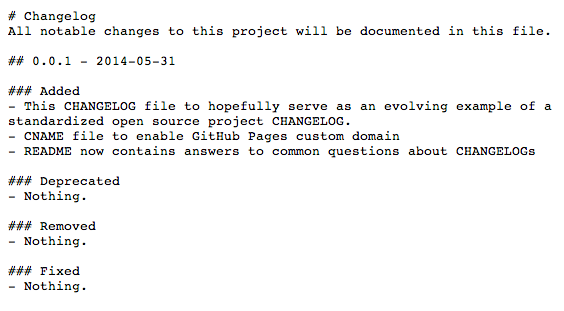

# Keep a CHANGELOG

## It's good for open source projects & their users.

### What's a CHANGELOG?
A CHANGELOG is a file which contains a curated chronologically ordered 
list of notable changes for each version of an open source project.

### What's the point of a CHANGELOG?
To make it easier for users and contributors to see precisely what 
notable changes have been made between each release (or version) of the project.

### What makes up a good CHANGELOG?
I'm glad you asked.

- It's made for humans, not machines, so legibility is crucial.
- One sub-section per versions.
- Versions should come with a release date in a sensible format: YYYY-MM-DD.
- Changes should be grouped to describe their impact on the project:
  - `Added` for new features.
  - `Deprecated` for once stable features removed in upcoming releases.
  - `Removed` for deprecated features removed in this release.
  - `Fixed` for any bug fixes.
  - `Security` to invite users to upgrade in case of vulnerabilities.
- Each section should be easily linked to — hence Markdown over plain text.

It's also good to mention whether the project 
follows [Semantic Versioning](http://semver.org/).

### Is there a standard CHANGELOG format?
Sadly, no, but this is something I want to change. This project 
[contains what I hope will become the standard CHANGELOG file](CHANGELOG.md) 
for all open source projects, so take a look at it and please suggest improvements.

The maintainers of [Vandamme](http://tech-angels.github.io/vandamme/#changelogs-convention)
have established interesting conventions, most of which are sensible.

### What should the CHANGELOG file be named?
Well, if you can't tell from the example above, `CHANGELOG.md` is the 
best convention so far.

Some projects also use `HISTORY.txt`, `HISTORY.md`, `History.md`, `NEWS.txt`, 
`NEWS.md`, `News.txt`, `RELEASES.txt`, `RELEASE.md`, `releases.md`, etc.
It's a mess, that only makes it harder for people to find it.

### Why can't people just use a git log diff?
Because log diffs are full of noise. Can we really expect every single 
commit in an open source project to be meaningful and self-explanatory? 
That seems like a pipe dream.

### Can CHANGELOG files be automatically parsed?
It's hard because people follow wildly different formats and file names. 
The aforementioned [Vandamme](https://github.com/tech-angels/vandamme/) 
is a Ruby gem used by [Gemnasium](http://gemnasium.com) which parses many 
(but not all) open source project CHANGELOGs.

### Why do you keep writing CHANGELOG in all caps?
You're right, that is a bit shouty. Maybe it's because of the de facto 
convention that files pertaining to an open source project should be in 
all caps, for instance: [`README`](README.md), [`LICENSE`](LICENSE), 
[`CONTRIBUTING`](CONTRIBUTING.md).

It denotes that these files are metadata for the project, similarly to 
[open source project badges](http://shields.io/) they draw attention to 
themselves as information people should be aware of if they mean to use 
the project or contribute to it.

